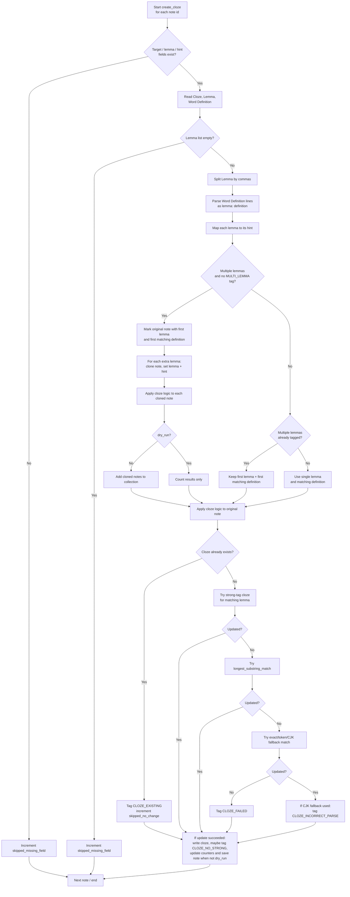

# Cloze Creation Flow

This diagram reflects the current `create_cloze()` behavior in [`operations/cloze.py`](../../operations/cloze.py).



## Notes

- Multi-lemma notes are split before the main cloze application path runs.
- `Word Definition` is interpreted line-by-line using `lemma: definition`.
- If a lemma does not find a matching `lemma: definition` entry, the full hint text is used as a fallback.
- Cloze matching prefers:
  1. matching inside a single `<strong>...</strong>` block
  2. longest substring match
  3. exact/token/CJK fallback matching

## Inner Matching Logic

This diagram focuses on the `_apply_cloze_to_note()` decision tree.

```mermaid
flowchart TD
    A[Start _apply_cloze_to_note] --> B{Already contains<br/>{{c1:: ?}}
    B -- Yes --> B1[Tag CLOZE_EXISTING<br/>return skipped_no_change]
    B -- No --> C[Count strong tags]
    C --> D{Exactly one<br/><strong>...</strong> block?}
    D -- Yes --> E[Try _wrap_strong_cloze_for_lemma]
    D -- No --> F[Skip strong-first path]
    E --> G{Updated?}
    F --> G
    G -- Yes --> H[Success]
    G -- No --> I[Try longest_substring_match]
    I --> J{Updated?}
    J -- Yes --> H
    J -- No --> K[Try _find_match_text<br/>exact / longest token / CJK]
    K --> L{Updated?}
    L -- No --> M[Tag CLOZE_FAILED<br/>return failed]
    L -- Yes --> N{CJK prefix/single<br/>fallback used?}
    N -- Yes --> O[Tag CLOZE_INCORRECT_PARSE]
    N -- No --> P[Continue]
    O --> H
    P --> H
    H --> Q{No strong tag used<br/>and zero strong blocks?}
    Q -- Yes --> R[Tag CLOZE_NO_STRONG]
    Q -- No --> S[No extra tag]
    R --> T[Write updated cloze<br/>when not dry_run]
    S --> T
    T --> U[Return success counts]
```
